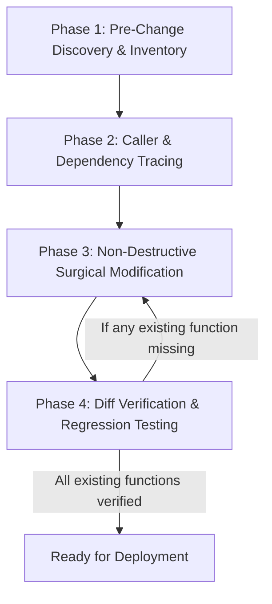

# System Impact Analysis & Function Preservation Guardrail

> **Purpose**: A comprehensive framework and operational guide to analyze the system before making code changes, ensuring that existing functions, features, API contracts, UI capabilities, and database structures are **never accidentally removed, degraded, or broken**.

---

## 📑 Table of Contents
1. [Core Principles of Non-Destructive Development](#1-core-principles-of-non-destructive-development)
2. [The 4-Phase System Analysis Protocol](#2-the-4-phase-system-analysis-protocol)
3. [Component & Layer-Specific Checklists](#3-component--layer-specific-checklists)
   - [A. Frontend Components & Pages (React / Vite)](#a-frontend-components--pages-react--vite)
   - [B. Backend APIs & Controllers (Express / Node.js)](#b-backend-apis--controllers-express--nodejs)
   - [C. Database & Migrations (PostgreSQL)](#c-database--migrations-postgresql)
4. [Anti-Patterns & Pitfalls to Avoid](#4-anti-patterns--pitfalls-to-avoid)
5. [System Analysis Template (Use Before Any Major Task)](#5-system-analysis-template)
6. [Post-Change Verification Checklist](#6-post-change-verification-checklist)

---

## 1. Core Principles of Non-Destructive Development

| Principle | Description | Golden Rule |
| :--- | :--- | :--- |
| **Additive Over Mutative** | Introduce new capabilities by extending or overloading existing functions rather than replacing them. | *Never delete or rename an existing parameter, prop, or response field if existing consumers depend on it.* |
| **Surgical Editing** | Always use targeted line/chunk replacements rather than wiping and replacing entire files. | *Keep untouched helper functions, comments, edge cases, and error boundaries intact.* |
| **Caller Tracing** | Before changing a signature, search across the entire project for all callers. | *Grep before edit: Know every file that imports or calls the target symbol.* |
| **Full Feature Inventory** | Explicitly inventory all existing capabilities before writing any code. | *If a component has 5 buttons and 3 modals, all 5 buttons and 3 modals must remain working.* |

---

## 2. The 4-Phase System Analysis Protocol



### Phase 1: Pre-Change Discovery & Inventory
1. **Read the Full Target File**: Inspect the file completely from top to bottom.
2. **List All Existing Exports & Functions**:
   - Component names, custom hooks, helper utilities.
   - Controller handlers, middlewares, database queries.
   - State variables (`useState`, `useReducer`, global contexts, refs).
3. **List All UI Actions**:
   - Search/filter bars, pagination, sort controls, modal triggers, print/export buttons, status badges, action dropdowns.
4. **List All Side Effects**:
   - `useEffect` dependencies, API calls, event listeners, timer intervals, audit log triggers.

### Phase 2: Caller & Dependency Tracing
1. Run a repository-wide search (grep) for the function/component/route name.
2. Check:
   - **Frontend**: Which pages, routes, or parent components import this?
   - **Backend**: Which routers expose this controller? Which frontend services call this endpoint?
   - **Data Flow**: What JSON structure does the client expect from the response?

### Phase 3: Non-Destructive Surgical Modification
1. Target only the specific code blocks that require updates.
2. Maintain existing function signatures (provide default values for any new parameters).
3. Ensure backwards compatibility for API response objects (add new fields without removing old ones).
4. Preserve all existing error handling (`try/catch`, status code handling, fallback UI).

### Phase 4: Diff Verification & Regression Testing
1. Execute `git diff <file>` to inspect changes.
2. Compare line-by-line:
   - Are all previous function names still present?
   - Are any existing props, hooks, or imports accidentally omitted?
   - Are all existing buttons and interactive elements present in the JSX?

---

## 3. Component & Layer-Specific Checklists

### A. Frontend Components & Pages (React / Vite)

Before modifying any `.jsx` / `.tsx` component, confirm:

- [ ] **State Variables**: All existing `useState`, `useMemo`, `useCallback`, and `useRef` declarations are preserved.
- [ ] **Props & Callbacks**: Existing component prop names and callback signatures are retained.
- [ ] **Sub-Components & Modals**: All child dialogs, confirmation drawers, drawer sidebars, and tooltips remain accessible.
- [ ] **Action Handlers**: Event handlers (e.g., `handleSearch`, `handleExport`, `handleApprove`, `handlePrint`, `handleFilter`) are still attached to their respective elements.
- [ ] **Loading & Empty States**: Loading spinners, empty list indicators, and error boundaries are not removed.
- [ ] **Router & Navigation**: Active route paths, URL query parameters, and navigation links remain intact.

### B. Backend APIs & Controllers (Express / Node.js)

Before modifying any backend route or controller, confirm:

- [ ] **Route Signatures**: HTTP method (GET, POST, PUT, DELETE) and URL paths are preserved.
- [ ] **Request Parsing**: `req.query`, `req.params`, and `req.body` handling continues to support existing parameter names.
- [ ] **Response Contract**: The JSON structure returned (`{ success, data, message, meta }` or array) preserves existing keys and types.
- [ ] **Authentication & Authorization**: `authenticateToken`, role checks, and permission middlewares are not bypassed or removed.
- [ ] **Database Integrity**: Queries retain essential `WHERE`, `JOIN`, and `ORDER BY` clauses to avoid fetching corrupt or unrestricted data.
- [ ] **Audit Logging**: Any existing audit trail records (`document_audit_logs`, history tables) continue to log actions.

### C. Database & Migrations (PostgreSQL)

Before modifying database tables or schemas, confirm:

- [ ] **No Destructive Operations**: Never run `DROP TABLE`, `DROP COLUMN`, or `TRUNCATE` without explicit verification and backups.
- [ ] **Nullable Defaults**: When adding new columns, provide safe `DEFAULT` values or allow `NULL` so existing rows and inserts do not fail.
- [ ] **Constraint Checks**: Ensure foreign keys and unique constraints do not break existing historical records.
- [ ] **Index & Performance**: Retain existing indexes and foreign key references.

---

## 4. Anti-Patterns & Pitfalls to Avoid

| ❌ Dangerous Anti-Pattern | ✅ Safe Non-Destructive Pattern |
| :--- | :--- |
| **Whole-file Rewrite**: Overwriting a 500-line file with a 100-line "simplified" version. | **Targeted Replacement**: Editing only the specific 10–20 lines that need improvement using precise line replacements. |
| **Dropping Existing Props**: Removing `showActions` or `onStatusChange` prop because the new view doesn't immediately use it. | **Optional / Default Props**: Keeping existing props with default values to maintain compatibility for other callers. |
| **Renaming API Response Keys**: Changing `position_title` to `positionTitle` breaking all frontend components expecting `position_title`. | **Payload Extension**: Providing both or alias mappings, or retaining standard backend snake_case. |
| **Silently Deleting Unused Code**: Deleting helper functions or export constants assuming they are "dead". | **Usage Verification**: Grepping the repository first to verify if any script, test, or sub-module relies on it. |

---

## 5. System Analysis Template

You or an AI agent can fill out this template **before starting work on any feature or fix**:

```markdown
### 🔍 Pre-Modification System Analysis

**1. Target File(s):**
- `path/to/file.jsx`

**2. Existing Function & Feature Inventory:**
- Function 1: `fetchData()` -> Handles pagination, query filters, error alerts.
- Function 2: `handleExport()` -> Generates Excel / PDF export.
- UI Controls: Search bar, Status filter dropdown, Action modal.
- State Hooks: `page`, `pageSize`, `filters`, `selectedItem`, `isModalOpen`.

**3. Callers & Dependents Found:**
- Imported by: `apps/web/src/config/routes.jsx`
- API called: `GET /api/vacancies`, `POST /api/vacancies/:id/apply`

**4. Invariants (MUST NOT BREAK):**
- User must still be able to filter by status and export data.
- API response structure must remain `{ vacancies: [...], total: ... }`.

**5. Proposed Safe Change Plan:**
- Add new column/tab without altering existing column renderers.
- Use surgical edit on lines 120-145 only.
```

---

## 6. Post-Change Verification Checklist

Run through this checklist after code edits:

- [ ] **Diff Check**: `git diff` shows only the intended additions and modifications.
- [ ] **Zero Missing Exports**: Every previously exported constant, function, or component is still present.
- [ ] **Zero Broken Callers**: All importing files continue to compile and function without errors.
- [ ] **UI Integrity**: All interactive buttons, modals, and views render properly and trigger their respective handlers.
- [ ] **API Backward Compatibility**: Existing API clients receive all expected fields.
